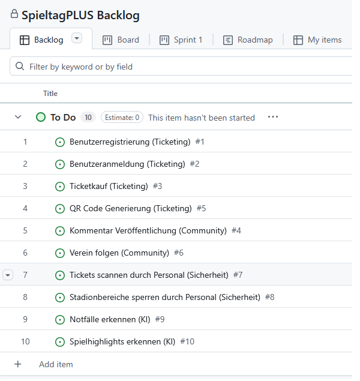

# Vorgehensmodelle
Scrum / Kanban recherchieren / experementieren / testen

## 1. Gewähltes Vorgehensmodell

Für das Projekt SpieltagPLUS habe ich Scrum als Vorgehensmodell gewählt, da ich es als bessere Grundlage für eine iterative Entwicklung sehe als Kanban und mein Projekt Produktentwicklung, neue Features und viele Stakeholder beeinhaltet. Also viele Herausforderungen und viel Feedback dazu. AUSSERDEM arbeite ich mit Kanban in meinem Job, Scrum kenne ich nur aus der Theorie und möchte es daher hier für mein Projekt mal anwenden, um mehr Einblick zu bekommen. 

## 2. Scrum 

### Scrum

Scrum basiert auf kurzen Sprints, klar definierten Rollen und regelmäßigen Feedbackschleifen.

Bestandteile:

- Product Backlog
- Sprint Backlog
- Sprint Planning
- Daily Scrum
- Sprint Review
- Sprint Retro

Vorteile gegenüber Kanban:

- feste Rhythmen
- nach jedem Sprint Produktzuwachs
- klare Verantwortlichkeiten (Product Owner, Scrum Master, Entwickler)
- regelmäßige feedbacks

### Scrum Tools
  
- GitHub Projects: GitHub Projects ist direkt in GitHub integriert und ermöglicht die Verwaltung von User Stories, Product Backlogs und Iterationen. Lässt sich mit Issues und Quellcode verknüpfen.
- Jira: Am weitesten verbreitete Scrum- und Projektmanagementwerkzeug in der Softwareentwicklung. Jira unterstützt Product Backlogs, Sprintplanung, Burndown-Charts und umfangreiche Auswertungen. Industriestandard.
- Trello: Einfaches, kartenbasiertes Projektmanagementwerkzeug. Durch frei konfigurierbare Listen eignet es sich ebenfalls zur Umsetzung von Scrum-Boards. Schnelle Einrichtung.

## 3. Experementieren

GitHub Projects:
Siehe https://github.com/users/smolareck-kuchinke/projects/4/views/1

## 4. Erkenntnisse aus den Spotify-Videos

Die beiden Spotify-Videos zeigen, wie agile Entwicklung bei Spotify umgesetzt wird.

Spotify verwendet Scrum nicht strikt nach Lehrbuch. Teams organisieren sich weitesgehend selbst. Vertrauen ist wichtiger als starre Prozesse. 
Agile Methoden werden nicht einfach übernommen, sondern an Teams (Squads) angepasst, so dass diese selbst entscheiden, ob Sie Scrum, Kanban etc. nutzen.

Die Organisationphilosophie ist "aligned autonomy", d.h. Teams werden dazu befähigt, eigenständig Entscheidungen zu treffen, während gleichzeitig sichergestellt wird, dass diese Entscheidungen die übergeordnete Mission, die Ziele und die Werte des Unternehmens unterstützen.

Dafür gibt es: 
- Squads statt Scrum Teams: kleine, autonome Teams, die eigenverantwortlich an einem Produktbereich arbeiten. Sie entscheiden sebst, was gebaut wird, wie es gemacht wird und auf welche Art man in der Gruppe zusammenarbeitet.
  "Loosely coupled, Tightly aligned squads". Mehrere Squads sind Tribes.
- Chapter, die Mitarbeitende mit ähnlichen fachlichen Rollen verbinden wie Web-Developer
- und Guilds: Interessenrgruppen aus verschienden Tribes z.B. Sicherheit , KI etc. um Erfahrungen asuzutauschen.

Ansonsten:
- "Community > Structure!" 
- "Release schould be Routine not Drama" -> kleine, regelmäßige Releases statt große, komplexe (Big Projects = Big Risk)
- "We aim to make mistakes faster than anyone else" -> Strategie dahinter: Fails Fast -> Learn Fast -> Improve Fast! Also: Fail-friendly environment
- Spotify Hack Week: Do Whatever" With Whoever" In Whatever way! -> Kreativität fördern
- Waste-repellent Culture: Wenn es klappt, behalten! Andernfalls (schnell) verwerfen!
 

## 5. Backlog

### Folgendes Backlog habe ich für SpieltagPLUS erstellt:

### Sprint 1 Planung: 2 Wochen / Ziel: EIn Fan kann sich registrieren, anmelden und ein ticket kaufen. 

User Stories:

- Benutzerregistrierung: Fan möchte sich registrieren können.
- Benutzeranmeldung: Fan möchte sich anmelden können.
- Ticketkauf: Fan möchte ein Ticket erwerben.
- QR-Code-Generierung: Fan möchte QR-Code nachdem kauf erhalten.

Warum ich das ausgewählt habe? 
Da ich diese vier User Stories benötige, um das Produkt minimal nutzbar zu machen. 

### Nicht in Sprint 1 enthalten, sondern in späteren Iterationen, weil es Erweiterungen sind, die nicht für die Minimalfunktionen gebraucht werden:
- Kommentar veröffentlichen
- Verein folgen
- Tickets scannen
- Stadionbereiche sperren
- Notfälle erkennen
- Spielhighlights erkennen

### Ergebnis nach Sprint 1

User kann sich registrieren, anmelden, Ticket kaufen und erhält QR-Code für den Eingang zum Spiel.
Somit haben wir dadurch schonmal ein nutzbares Produktinkrement.

### Risiko

- Benutzerverwaltung muss zuverlässig funktionieren
- QR-Code muss technisch sauber erstellt werden
- Ticketkauf braucht zukünftig die Anbindung externer Bezahldienste per API, damit der Komfort steigt und viele. gängige Zahlungsarten angeboten werden können

### Definition of Done (DoD) Kriterien
User Story gilt als abgeschlossen, wenn
- die Funktion implementiert wurde
- die Funktion getestet wurde
- dokumentiert wurde
- und der Code im Repo verfügbar ist.

